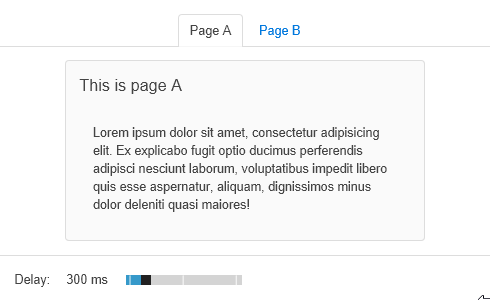
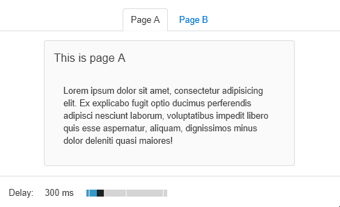
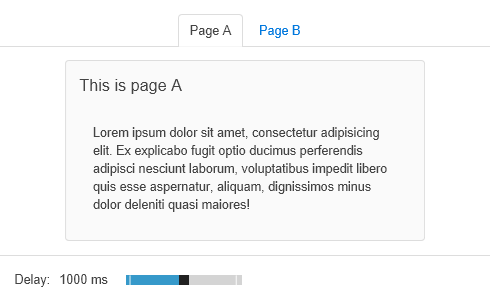
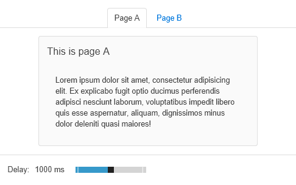

# Aurelia-Animate-Early
This repo is a demo/proof of concept for issue https://github.com/aurelia/templating-router/issues/8

## What is the issue about?
With Aurelia, a good place to load a screen data is in its `activate()` method.

If you animate your screen swaps, Aurelia will perform the swaps entirely after `activate()` has completed.
The issue is about removing the old screen immediately after `deactivate()`, which means the "leave" animation and the data loading can happen in parallel.

Literature says an interaction feels immediate if the response time is around 0.1s.

If your loading code takes > 0.1s the app feels laggy. Or you can display a loading indicator immediately, which feels snappy... but obviously "loading".

Using animations judiciously can hide this. 
Immediate out animation feels snappy. If the loading time is faster than animation (ideally ~300ms) it seems that the application never loads.
If the loading time is longer, the animation helps making it seem shorter.

## Demo
This repo contains a demo app with two pages.

Going from page B to page A is immediate, going from A to B simulates a loading time that can be changed at the bottom of the page.

To run the demo:
``` 
npm install
node web
start "" http://localhost:4000/index.html
```

| 300ms Late | 300ms Early |
|---|---|
|  |  |

| 1000ms Late | 1000ms Early |
|---|---|
|  |  |

## Can I use this?
If you want to, copy `aurelia-animate-early.ts` from this repo and call `.plugin('./aurelia-animate-early')` in your configuration code. 